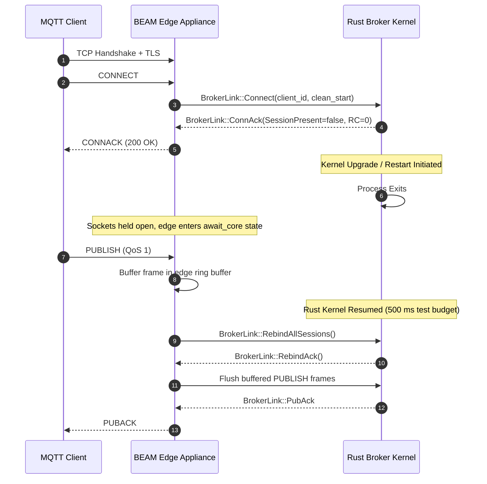
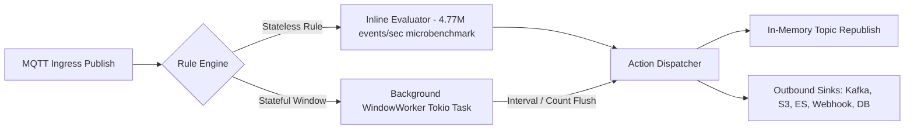

# IndraMQTT Architecture Specification

**IndraMQTT** ([indramqtt.com](https://indramqtt.com)) is a distributed, ultra-concurrent MQTT messaging and streaming platform designed for hyper-scale cloud deployments and mission-critical industrial edge systems.

This document details the internal design, concurrency models, data flows, and layer decoupling of IndraMQTT. Routing and rule evaluation are measured by in-process microbenchmarks in `crates/broker-node/benches/broker_throughput.rs`: `bench_router_match_throughput` reports ~3.05M hit-path lookups/sec across 1,000 installed filters (3 targets) and ~7.80M fast-miss lookups/sec single-threaded, and `bench_sql_ingress_throughput` reports ~4.77M events/sec single-threaded with 100 percent sink delivery; these are function-call rates, not end-to-end network throughput (end-to-end loopback measurements live in `benchmark_suite/benchmark_results_v5.json`). Restart immunity (the edge holds the client socket in `await_core` and rebinds without a disconnect) is proven only for a single loopback connection against a fake core by `core_restart_zero_disconnect_test` in `beam/test/indra_chaos_tests.erl` (500 ms recovery budget). No idle-RSS benchmark is committed in-tree, so no idle footprint figure is claimed here.

---

## 1. High-Level Architecture Overview

IndraMQTT separates the networking edge from the broker kernel through a clean 3-tier decoupled model:

```mermaid
graph TB
    subgraph Clients[MQTT Edge Clients]
        TCP_CLI[MQTT Clients :1883]
        TLS_CLI[MQTTS Clients :8883]
        WS_CLI[WebSocket Test Console :18083 /ws/mqtt]
    end

    subgraph BEAM[Layer 1: BEAM Network Appliance - Erlang/OTP 26+]
        ACCEPTOR[Socket Acceptors & TLS Term]
        FRAMING[MQTT Framing & Packet Codec]
        KEEPALIVE[Keep-Alive Timers & Backpressure]
        STATE_MIRROR[Hot QoS Mirror]
        REBIND[Core Re-bind State Machine]
    end

    subgraph IPC[Layer 2: Multi-Lane BrokerLink IPC]
        UDS[Unix Domain Socket / Memory Stream]
        LANE_HASH[Consistent Hashing: conn_id % num_lanes]
        PROTO_FRAMING[Zero-Copy Binary Framing]
    end

    subgraph Core[Layer 3: Rust Core Engine - Community MIT / Apache-2.0]
        ROUTER[Radix Trie Router - ahash / Arc str]
        SESSION[Canonical Session Manager]
        STORAGE[Segmented Log & Cursor Persistence]
        AUTH[AuthN & ACL Rule Engine]
        QUOTA[Multi-Tenant Quotas & Rate Limiter]
        SQL[Embedded rekuiper Streaming SQL Engine]
        CONNECTORS[Unified Connectors: Kafka, PG, Redis, S3, ES, Webhook]
        REST[Axum REST API & Web Dashboard :18083]
    end

    subgraph Enterprise[Layer 4: Distributed Clustering - Enterprise LICENSE]
        QUIC[QUIC Multiplexed Data Plane]
        SWIM[SWIM Gossip Failure Detection]
        RAFT[Raft Metadata Consensus]
        WINDOWS[Stateful rekuiper Window Operators]
        INDUSTRIAL[Industrial Protocols: Sparkplug B, OPC-UA]
    end

    Clients --> BEAM
    BEAM --> IPC
    IPC --> Core
    Core --> Enterprise
```



---

## 2. Core Architectural Invariants

### 1. Connection != Session (Core Restart Immunity)
In legacy brokers (e.g., HiveMQ, VerneMQ, Mosquitto), a broker node restart or software upgrade tears down all client TCP sockets, triggering massive "reconnect storms" and thundering-herd issues on downstream authentication backends.

In IndraMQTT:
- The **BEAM Network Appliance** (Erlang/OTP) owns client sockets, TLS sessions, packet framing, and keepalives. It has no business logic, no distributed database, and no rule engine.
- The **Rust Core Engine** owns the canonical session, subscription state, inflight QoS tracking, offline queues, and rule engines.
- **Protocol scope**: the edge speaks MQTT v3.1.1 only (`decode_connect` in `beam/src/indra_mqtt_codec.erl` accepts protocol level 4 and rejects level 5 as `unsupported_protocol`); MQTT v5 is not supported yet. TLS is the edge `ssl` transport (proven by `tls_connect_connack_test` in `beam/test/indra_listener_tests.erl`). MQTT-over-WebSocket is a dashboard test console on the API port (`/ws/mqtt` in `crates/broker-api/src/ws.rs`), not an edge listener on `:8083`.
- If the Rust core restarts or upgrades, the BEAM edge buffers uncommitted frames, maintains open client TCP/TLS sockets, and re-binds active sessions upon core resumption. Recovery within 500 ms without a client TCP disconnect is proven only for a single loopback connection against a fake core by `core_restart_zero_disconnect_test` in `beam/test/indra_chaos_tests.erl`; this is not a multi-client production restart measurement.



---

### 2. Multi-Lane BrokerLink IPC
Communication between the BEAM edge and Rust core occurs over **BrokerLink**, a custom high-performance binary protocol:
* **Multi-Lane Affinity**: Erlang hashes connection IDs across $N$ parallel IPC lanes (`conn_id % num_lanes`). This guarantees strict per-client FIFO message ordering while completely eliminating cross-client head-of-line blocking.
* **Opaque Payloads**: Payloads remain zero-copy opaque byte buffers until evaluated by the rules engine.
* **Credit-Based Flow Control**: Prevents memory exhaustion during massive ingress spikes.

---

### 3. Lock-Free Radix Trie Subscription Router
The subscription router in `crates/broker-router` is optimized for zero memory allocations on hit paths:
* **Segment Tokens**: Subscription filters (`device/+/temperature`, `sensors/#`, `$share/group1/data`) are parsed into token slices stored with zero-allocation `Arc<str>` and fast hashing (`ahash`).
* **Fast-Miss Traversal**: Walk-only branch evaluation sustains **~7.80M ± 0.20M lookups/sec** on fast-miss lookups in the in-process single-threaded microbenchmark `bench_router_match_throughput` in `crates/broker-node/benches/broker_throughput.rs`; not end-to-end network throughput.
* **Hit-Path Saturation**: Evaluates exact and wildcard subscriptions at **~3.05M ± 0.10M lookups/sec** across 1,000 installed filters (3 targets per lookup) in the in-process single-threaded microbenchmark `bench_router_match_throughput` in `crates/broker-node/benches/broker_throughput.rs`; not end-to-end network throughput.

---

### 4. Embedded Streaming SQL Engine (`rekuiper`)
IndraMQTT embeds the [`rekuiper-sql`](https://github.com/ankur-paan/rekuiper) stream processing engine directly in-process:



* **Stateless Rules (Community Tier)**:
  - 185 scalar functions (trigonometry, math, bitwise, string, datetime, conditionals; catalog length asserted by `test_function_catalog_has_185_entries` in `crates/broker-rules/src/lib.rs`).
  - Evaluated inline on the ingress thread with zero task spawns and zero network loopback at **~4.77M ± 0.10M events/sec** in the in-process single-threaded microbenchmark `bench_sql_ingress_throughput` in `crates/broker-node/benches/broker_throughput.rs` (JSON parsing plus `WHERE`/`SELECT` with `Block` backpressure and 100 percent sink delivery); not end-to-end network throughput.
* **Stateful Window Operators (Enterprise Tier)**:
  - `TUMBLINGWINDOW`, `HOPPINGWINDOW`, `SLIDINGWINDOW`, `COUNTWINDOW`.
  - Dedicated background Tokio worker tasks with interval bounds injection (`window_start()`, `window_end()`).
  - Multi-event aggregations (`avg`, `sum`, `count`, `min`, `max`, `stddev`, `percentile`).
* **Declarative SQL Routing**:
  - Supports SQL `INTO connector("id")` syntax:
    ```sql
    SELECT clientid, temperature * 1.8 + 32 AS temp_f 
    FROM "factory/+/sensors" 
    WHERE temperature > 40.0 
    INTO connector("kafka-edge")
    ```

---

### 5. Outbound Connectors & Streaming Bridges
Outbound integrations implement the unified `Sink` trait in `crates/broker-connectors`:
```rust
#[async_trait]
pub trait Sink: Send + Sync {
    async fn send(&self, topic: &Topic, payload: &Bytes, qos: QoS) -> Result<(), ConnectorError>;
    fn kind(&self) -> &'static str;
}
```

* **Micro-Batching & Backoff**: Standardized using shared `BatchQueue` and `BackoffState` helpers.
* **Zero External Dependencies in Tests**: All unit and integration tests execute against in-memory mock transports (`MemoryKafkaTransport`, `MockS3Transport`, `MockHttpTransport`, `MemoryDiskLogWriter`, etc.).
* **Capability & Qualification**: See `crates/broker-connectors/CAPABILITY.md` for what each sink actually speaks and what it was tested against; no sink in this tree has been qualified against a real vendor server.

---

### 6. Zero-Limit Scale Architecture
IndraMQTT does not contain hardcoded or clamped limits:
* `window_channel_depth`: Fully configurable on `RuleEngine` (default 65,536, unbounded capable).
* `max_offline_queue`: Fully configurable on `SessionManager` (default 10,000, `None` = unbounded).
* Connection pools, batch limits, and rotation thresholds are unconstrained.

For full benchmarks and deployment configurations, visit [indramqtt.com](https://indramqtt.com).
