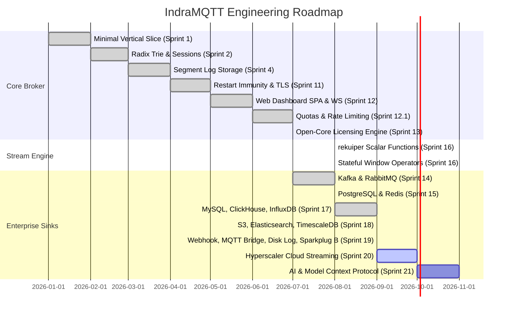

# IndraMQTT Master Roadmap

**IndraMQTT** ([indramqtt.com](https://indramqtt.com)) is on a mission to build the world's most concurrent, low-latency, and extensible distributed MQTT and stream processing platform.

This roadmap outlines our completed milestones, active sprint, and future capabilities.

---

## 1. Platform Milestones

---

## 2. Active Engineering Focus: Sprint 20

### Hyperscaler Cloud Streaming & Enterprise Pub/Sub
- [ ] **INDRA-197: Amazon Kinesis Data Streams Sink** (`crates/broker-connectors/src/kinesis.rs`)
  - `PutRecords` batch ingestion, SigV4 signing, partition key derivation, partial-failure backoff retry.
- [ ] **INDRA-199: Google Cloud Pub/Sub Sink** (`crates/broker-connectors/src/gcp_pubsub.rs`)
  - `publish` batch API, ordering keys, dynamic attributes, OAuth2/JWT token signing.
- [ ] **INDRA-198: Azure Event Hubs Sink** (`crates/broker-connectors/src/azure_eventhubs.rs`)
  - REST/AMQP batch ingestion, Shared Access Signature (SAS) token generation, partition hashing.
- [ ] **INDRA-153: Apache Pulsar Producer Sink** (`crates/broker-connectors/src/pulsar.rs`)
  - Multi-tenancy (`tenant/namespace/topic`), keyed partition routing, monotonic sequence tracking.
- [ ] **INDRA-218: Cloud Streaming Studio** (`crates/broker-api` & `crates/broker-rules`)
  - REST registration, Web Dashboard management forms, and multi-cloud SQL `INTO` fanout.

---

## 3. Upcoming Milestones

### Sprint 21: AI, LLM & Model Context Protocol (MCP) Suite
* **INDRA-141: OpenAI Sink**: Streaming completions and tool calling over MQTT; prompt templates hydrated by streaming SQL events.
* **INDRA-142: Anthropic Claude Sink**: Claude Messages API integration with batched inference triggers from IoT event streams.
* **INDRA-143: Google Gemini Sink**: Gemini multimodal & structured JSON output connector using REST/gRPC API.
* **INDRA-144: Model Context Protocol (MCP) Bridge**: MCP client bridge allowing LLM agents to inspect broker state and invoke tools.
* **INDRA-145: MCP over MQTT**: Protocol adapter transporting JSON-RPC MCP messages natively across MQTT topic hierarchies.

### Sprint 22: Enterprise Document & NoSQL Sinks
* **INDRA-164: MongoDB Sink**: BSON document insert/update targeting collections derived from topic patterns.
* **INDRA-179: Amazon DynamoDB Sink**: Low-latency NoSQL document put-item / batch-write sink with TTL attributes.
* **INDRA-167: Apache Cassandra Sink**: CQL binary protocol sink with partitioned token-aware writes and tunable consistency.
* **INDRA-168: Couchbase Sink**: Key-Value and N1QL JSON document sink.

### Sprint 23: Industrial Automation & Field Protocols
* **INDRA-201: OPC-UA Industrial Bridge**: Bi-directional OPC-UA server node bridging to MQTT topics with binary codec.
* **INDRA-174: Apache IoTDB Sink**: Aligned time-series session pool for industrial plant telemetry.
* **INDRA-173: TDengine Sink**: High-performance super-table and sub-table connector.

### Sprint 24: Cloud Data Warehousing & Lakehouse Formats
* **INDRA-182: Snowflake Sink**: Direct Snowpipe micro-batch loading into Snowflake tables.
* **INDRA-183: Databricks Delta Lake Sink**: Direct Parquet streaming ingestion into Delta tables.
* **INDRA-186: Google BigQuery Sink**: BigQuery Storage Write API (gRPC) for exactly-once streaming.
* **INDRA-191: S3 Tables (Apache Iceberg) Sink**: Native Apache Iceberg metadata and data file writer backed by S3 Tables.

---

For inquiries, enterprise feature requests, or partnership discussions, visit [indramqtt.com](https://indramqtt.com) or reach out to [sales@i-dacs.com](mailto:sales@i-dacs.com).
