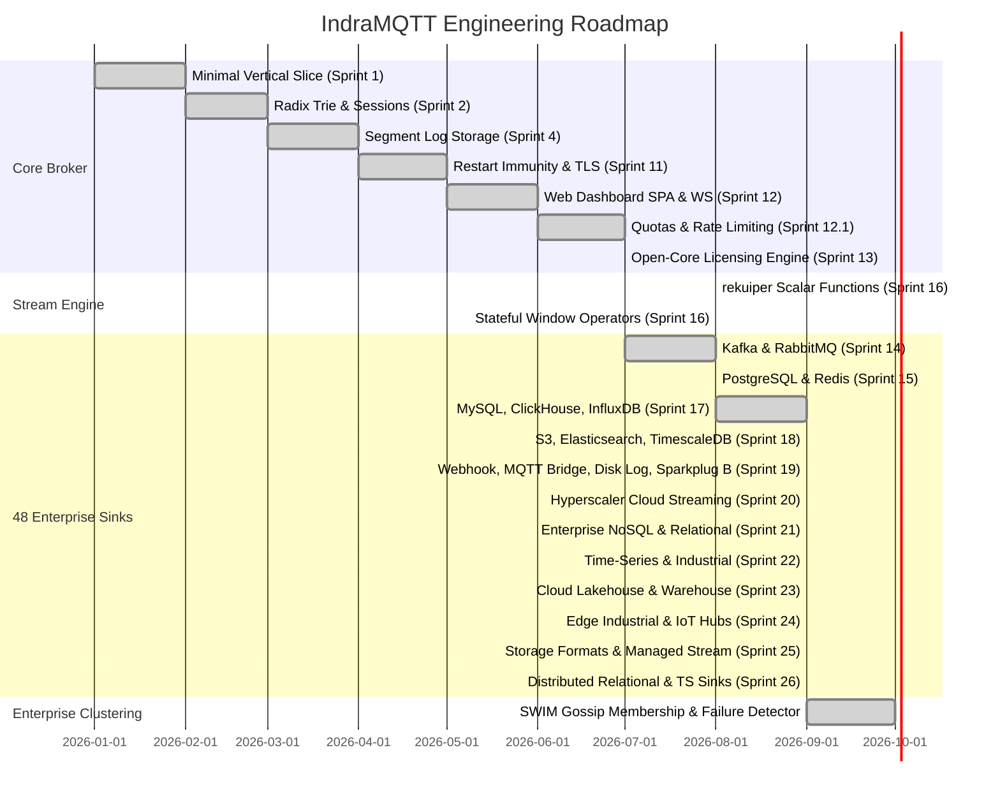

# IndraMQTT Master Roadmap

**IndraMQTT** ([indramqtt.com](https://indramqtt.com)) is on a mission to build the world's most concurrent, low-latency, and extensible distributed MQTT and stream processing platform.

This roadmap outlines our completed milestones, active capabilities, and future platform vision.

---

## 1. Platform Milestones

---

## 2. Completed Enterprise Sink Suite (All 48 Non-AI Connectors)

- [x] **Message Streaming (6/6)**: Apache Kafka, RabbitMQ, Confluent Cloud, Apache Pulsar, Apache RocketMQ, Remote MQTT Broker.
- [x] **Relational & Key-Value (10/10)**: PostgreSQL, MySQL, Redis, MongoDB, Microsoft SQL Server, Oracle Database, Apache Cassandra, Couchbase, CockroachDB, Google AlloyDB.
- [x] **Time-Series & Industrial (9/9)**: TimescaleDB, InfluxDB, TDengine, Apache IoTDB, OpenTSDB, GreptimeDB, Datalayers, Amazon Timestream, Amazon DynamoDB.
- [x] **Data Analytics & Warehousing (7/7)**: ClickHouse, Snowflake, Databricks, Elasticsearch/OpenSearch, Apache Doris, Google BigQuery, Amazon Redshift.
- [x] **Object Storage & Lakehouse (4/4)**: Amazon S3, Azure Blob Storage, Alibaba Tablestore, S3 Tables (Apache Iceberg).
- [x] **Cloud IoT Platforms & Industrial Edge (11/11)**: HTTP Webhook, AWS IoT Core, Azure IoT Hub, Google Cloud IoT, Oracle Cloud (OCI), Amazon Kinesis, Azure Event Hubs, GCP Pub/Sub, Sparkplug B, OPC-UA Bridge, Local Rotating Disk Log.
- [x] **Embedded Web Dashboard SPA & SQL Studio**: Live management console, metric delta visualizer, 48 connector configuration cards with Enterprise/Community tier badges, and WebSocket console.

---

## 3. Completed Enterprise Clustering & Decentralized Mesh

- [x] **SWIM Gossip Failure Detector (`crates/broker-cluster/src/swim.rs`)**:
  - Direct probe (`Ping` -> `Ack`) with indirect fallback (`PingReq` via $k$ peers).
  - Suspicion lifecycle (`Alive` -> `Suspect` -> `Dead`) with configurable timeouts.
  - Incarnation numbers with automatic self-refutation of false suspicions.
  - Piggybacked gossip dissemination on ping/ack envelopes.
  - Automatic purging of dead node topic filter routes from `ClusterRouteTable`.
  - Cryptographic Ed25519 cluster license evaluation and node quota enforcement.
  - Multi-node in-process channel transport (`ChannelSwimTransport`) and UDP network transport (`UdpSwimTransport`).
- [x] **Broker Node Runtime Wiring (`crates/broker-node/src/main.rs`)**:
  - `--cluster-seeds <addr>` and `--cluster-bind <addr>` CLI flags.
  - Dynamic discovery and mesh bootstrapping.

---

## 4. Deferred Milestones

- **Category A: AI & LLM Suite (`INDRA-141..INDRA-146`)**: OpenAI, Anthropic, Gemini, MCP Bridge, MCP over MQTT, Realtime AI. Bypassed per project directive.
- **Deep Soak / Chaos Suite (WSL)**: 5-hour high-concurrency soak and chaos test suite scheduled for execution on-demand in WSL.

---

For inquiries, enterprise feature requests, or partnership discussions, visit [indramqtt.com](https://indramqtt.com) or reach out to [sales@i-dacs.com](mailto:sales@i-dacs.com).
